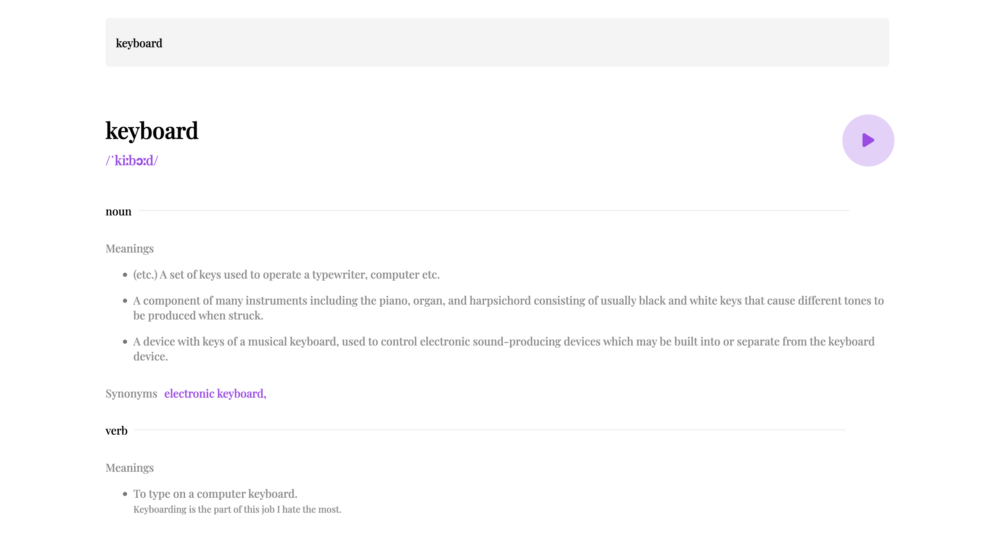
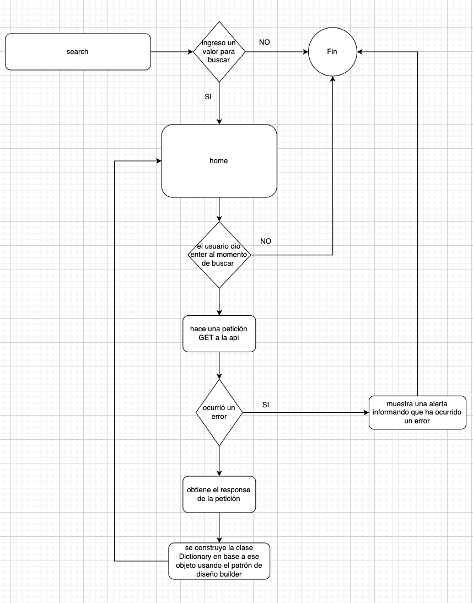

# Aplicación de diccionario

Aplicación de diccionario que consume la api Free Dictionary API, busca palabras como en un diccionario tradicional, busca las palabras en inglés y obtén los resultados al instante.

## Tech Stack

**Client:** Angular

**Server:** Free Dictionary API

**deployed in:** Firebase hosting
## Instalación local

Para instalar de manera local este proyecto simplemente ejecuta el siguiente comando:

```bash
  npm install
```

Para levantar el servidor de desarrollo:
```bash
  ng serve
```
El comando anterior debió de levantar un servidor de desarrollo en el localhost:4200

## Demo

Para ver una prueba en vivo visita [dictionary-demo](https://dictionary-web-app-55fbc.web.app/home)



## Diagrama




